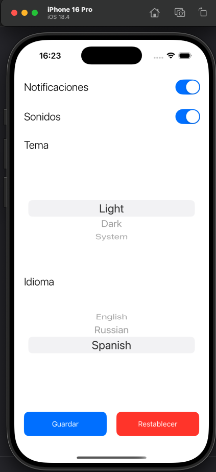
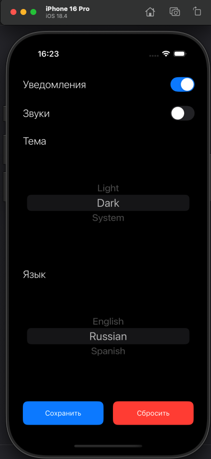
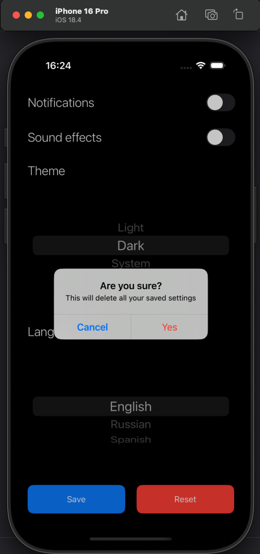

# SettingsApp

SettingsApp — это простое iOS-приложение, написанное на Swift с использованием UIKit. Оно позволяет пользователю настроить различные параметры, такие как уведомления, звуки, тема интерфейса и язык. Все настройки сохраняются локально на устройстве с помощью `UserDefaults`.

## 🧰 Технологии

- Swift
- UIKit
- UserDefaults
- UIStackView
- UISwitch
- UIPickerView
- UIButton
- UIAlertController

## 📸 Возможности

- Включение/выключение уведомлений
- Включение/выключение звуков
- Выбор темы интерфейса (светлая, тёмная, системная)
- Выбор языка интерфейса (английский, русский, испанский)
- Сохранение и восстановление данных при запуске приложения
- Сброс всех настроек с подтверждением

## 📱 Скриншоты

> 
> 
> 
> 
